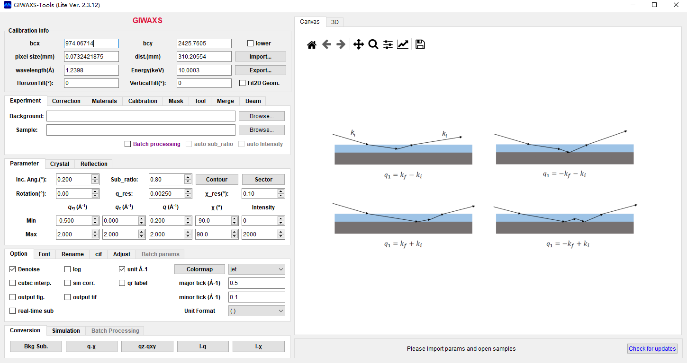
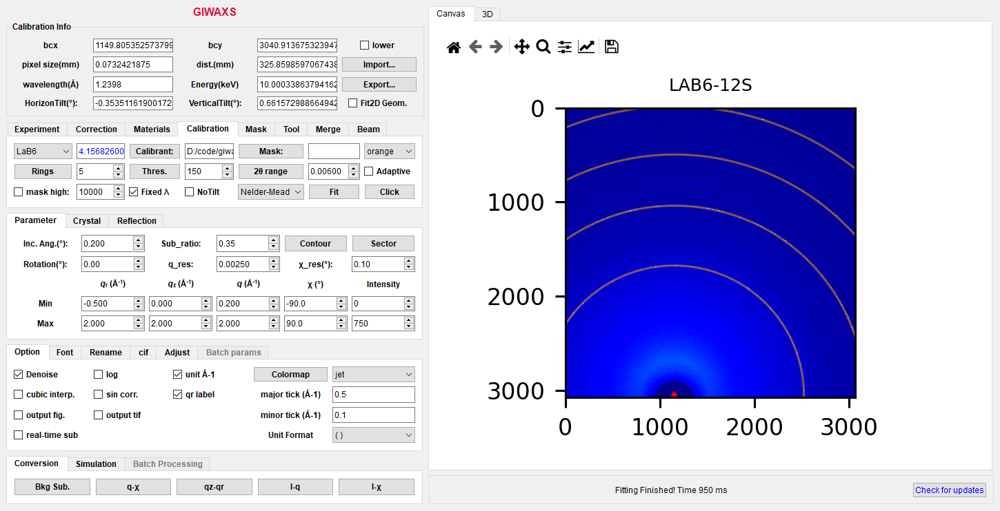
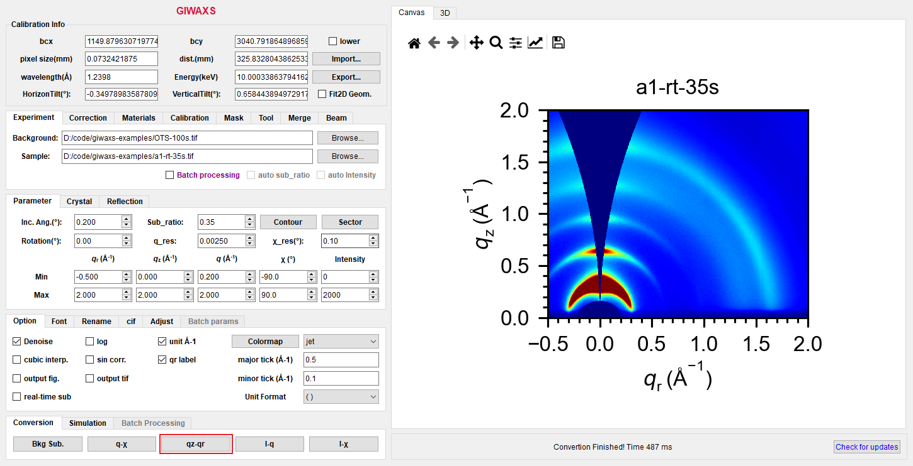
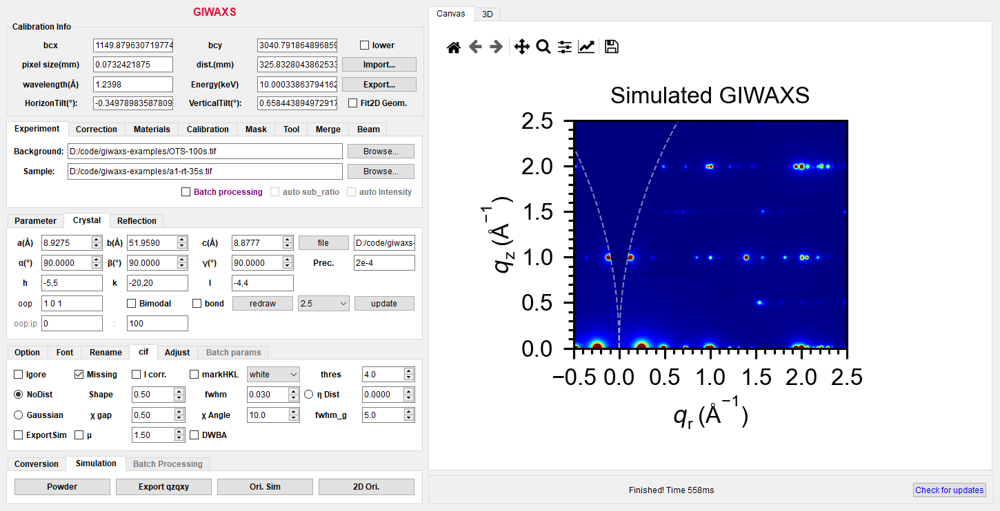
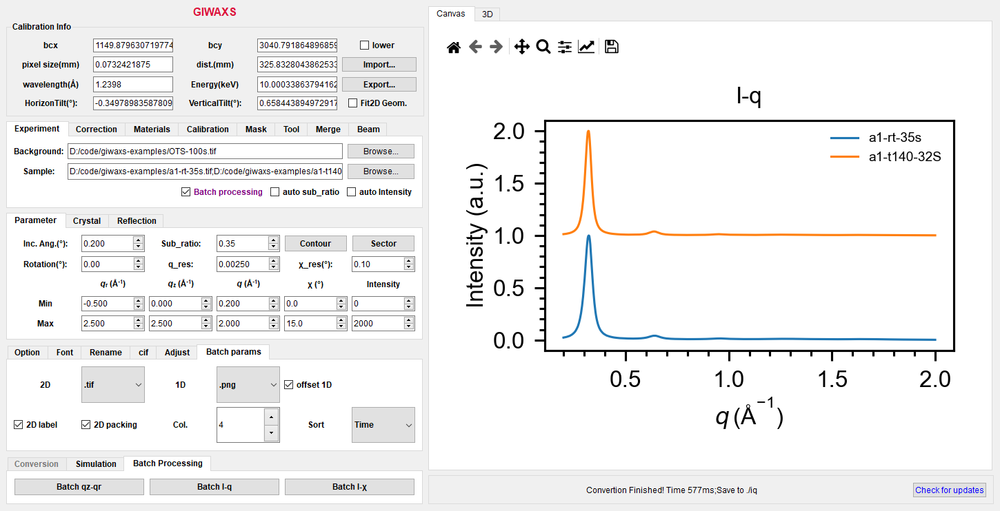

# GIWAXS-Tools

A software for processing and simulating grazing-incidence wide-angle X-ray scattering files

https://drive.google.com/drive/folders/1a8NIQZiPT8bwaGdw9mw_QSFsvEm09iSe

## Description

This software is written in python and packed by pyinstaller.
Python packages include: fabio, matplotlib, numpy, scipy, PySide6, pandas, openpyxl, periodictable, xlrd, pillow, h5py, gemmi, spglib, PyCifRW.

The program can handle qz-qxy/q-χ/ I-q/I-χ convertion, calculate refractive index, and simulate GIWAXS patterns for crystaline films.

## Usage

